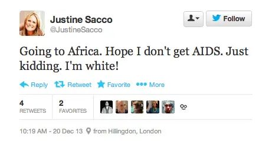
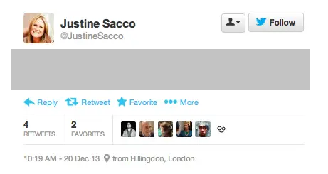

# The case of Justine Sacco’s racist joke tweet

In 2013, Justine Sacco, a PR director at IAC, was boarding a flight to South Africa, and posted the following racist and insensitive joke tweet, which went viral while she was in-flight and unable to check Twitter:
> 

## Timeline of events:
1. Justine Sacco, a PR director at IAC with only 170 followers posted a racist joke tweet right before getting on an 11-hour flight to South Africa
1. Someone emailed the tweet to valleywag.gawker.com. Valleywag wrote a post on it and tweeted the post.
1. Word spread, and Justine's tweet went viral. Twitter users found other recent offensive tweets by Justine about countries she was traveling in.
1. IAC (Justine's employer) called the tweet “outrageous, offensive” but “Unfortunately, the employee in question is unreachable on an international flight.”
1. Twitter users, now knowing that Justine is on a flight, started the hashtag #hasjustinelanedyet, which started trending on Twitter (including some celebrities tweeting about it).
1. Twitter users were able to deduce which flight Justine was on.
1. One Twitter user got a photo of Justine turning on her phone after getting off the plane. That user also talked to her father at the airport and tweeted about the photo and their responses.
   * 
1. Justine lost her job at IAC, apologized, and was later rehired by IAC.

Sources: [Buzzfeed](https://www.buzzfeednews.com/article/alisonvingiano/this-is-how-a-womans-offensive-tweet-became-the-worlds-top-s) {cite:p}`vingiano_this_2013`, [IBTimes](https://www.ibtimes.com/justine-sacco-twitter-revolt-fierce-blowback-after-aids-africa-tweet-sent-iac-execs-1517670) {cite:p}`noauthor_pr_2013`, later [Vox](https://www.vox.com/2018/1/19/16911074/justine-sacco-iac-match-group-return-tweet) {cite:p}`wagner_justine_2018`, later [New York Times profile](https://www.nytimes.com/2015/02/15/magazine/how-one-stupid-tweet-ruined-justine-saccos-life.html) {cite:p}`ronson_how_2015`

## What our focus will be
Rather than talk about whether any or all of the responses to Justine’s racist joke tweet were deserved, let’s instead talk about why it played out as it did:
- Why did so many people see it?
- How did it spread?
- What enabled someone to be able to get a photo of her checking the phone at the airport?

## Reflection questions
- What motivated Twitter users to put time and energy into this?
- What things about the design of Twitter enabled these events to happen?
  - 
  - For example, you might notice that the interface shows where Sacco was located when tweeting, Hillingdon, London, which is where Heathrow Airport is located, helping people deduce which flight she was on.
- What financial motivations does Twitter have? How does that influence Twitter's design?
- What changes to Twitter could have changed how this story went?
