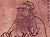
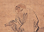
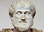
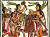
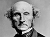
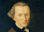
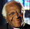
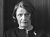
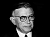

# Ethics Frameworks

Below are some summaries of a selection ethics frameworks. There are many more ethics frameworks which we haven't included here, and these explanations are all way oversimplified. We hope that this gives you a start to understanding each framework, and a range of options for how to think through ethics in social media and programming.

## Ancient Ethics
Here are few ancient ethics systems. These examples are mostly about qualities of a good person.

### [Confucianism](https://plato.stanford.edu/entries/confucius/)
Sources {cite:p}`csikszentmihalyiConfucius2020` {cite:p}`bilimoriaEthicalStudiesOverview2008` {cite:p}`olberding_review_2012` {cite:p}`olberding_moral_2012`
- Being and becoming an exemplary person (e.g., benevolent; sincere; honoring and sacrificing to ancestors; respectful to parents, elders and authorities, taking care of children and the young; generous to family and others). These traits are often performed and achieved through ceremonies and rituals (including sacrificing to ancestors, music, and tea drinking), resulting in a harmonious society.
- Key figures:
  -  [Confucius](https://plato.stanford.edu/entries/confucius/) {cite:p}`csikszentmihalyiConfucius2020`~500, China
  -  [Mencius](https://plato.stanford.edu/entries/mencius/) {cite:p}`vannordenMencius2019` ~350, China
  -  [Xunzi](https://plato.stanford.edu/entries/xunzi/) {cite:p}`goldinXunzi2018` ~300 BCE, China

### [Taoism](https://plato.stanford.edu/entries/daoism/) 
Sources {cite:p}`hansenDaoism2020` {cite:p}`chan_essential_1998` {cite:p}`chan_interpretations_2011`
- Act with unforced actions in harmony with the natural cycles of the universe. Trying to force something to happen will likely backfire.
- Rejects Confucian focus on ceremonies/rituals. Prefers spontaneity and play.
  - Like how water (soft and yielding), can, over time, cut through rock.
- Key figures:
  -  [Lao Tzu](https://en.wikipedia.org/wiki/Laozi) {cite:p}`Laozi2023` ~500 BCE China
  -  [Zhuangzi](https://plato.stanford.edu/entries/zhuangzi/) {cite:p}`hansenZhuangzi2021` Zhuangzi ~300 BCE China
 
### [Virtue Ethics](https://plato.stanford.edu/entries/ethics-virtue/) 
Sources {cite:p}`hursthouseVirtueEthics2023` {cite:p}`noauthor_virtue_2024` {cite:p}`foot_natural_2003` {cite:p}`PhilosophyWellBeingIntroduction`
- Acting in ways consistent with the virtues (e.g., courage, truthfulness, wittiness, friendliness, etc.) leads to flourishing of an individual.
- In acting virtuously, you are training yourself to become more virtuous, and you will subsequently be able to act even more virtuously.
- Different groups have different sets of virtues:
  - Aristotle: Courage, Temperance, Liberality, Magnificence, Magnanimity, Proper Ambition, Patience, Truthfulness, Wittiness, Friendliness, Modesty, Righteous indignation, Intelligence, Science, Theoretical Wisdom
  - Quaker [SPICES](https://www.friendsjournal.org/s-p-i-c-e-s-quaker-testimonies/) {cite:p}`CoreBeliefsQuakers2010` (Simplicity, Peace, Integrity, Community, Equality, Stewardship)
  - US Army [LDRSHP](https://www.army.mil/values/) {cite:p}`ArmyValues`: Loyalty, Duty, Respect, Selfless Service, Honor, Integrity, Personal Courage
- Key figures:
  -  [Aristotle](https://en.wikipedia.org/wiki/Aristotle) {cite:p}`Aristotle2023`, 300s BCE Greece
  -  {cite:p}`MarthaNussbaum2023a` [Martha Nussbaum](https://en.wikipedia.org/wiki/Martha_Nussbaum) {cite:p}`MarthaNussbaum2023`, present USA

### [Aztec Virtue Ethics](https://aeon.co/essays/aztec-moral-philosophy-didnt-expect-anyone-to-be-a-saint)
Sources {cite:p}`AztecMoralPhilosophy`{cite:p}`AztecPhilosophyInternet`
- Live a rooted, balanced life of moderation.
- Virtue is a group effort. Individuals can’t be virtuous on their own because “the earth is slippery, slick” (meaning it is easy for an individual to fall into bad actions, they need support and moderation)
-  {cite:p}`FileAztecDrums` [Aztecs](https://en.wikipedia.org/wiki/Aztecs) {cite:p}`Aztecs2023`, 1300s - 1500s CE in what is now Mexico

## 1600s - 1700s European Ethics
A few ethics systems that originated in the 1600s and 1700s in Europe. Note that in this selection of ethics frameworks motive and inner qualities don’t matter, only outward actions or outcomes.

### [Natural Rights](https://plato.stanford.edu/entries/rights/) 
Sources {cite:p}`wenarRights2023` {cite:p}`locke_clarendon_1975` {cite:p}`hobbes_leviathan_1651` {cite:p}`rousseau_social_2014` {cite:p}`benhabib_situating_1992` {cite:p}`phillips_unconditional_2021`
- Locke: Everyone has a right to life, liberty, and property
- Jefferson in the [Declaration of Independence](https://www.archives.gov/founding-docs/declaration-transcript) {cite:p}`DeclarationIndependenceTranscription2015`: “We hold these truths to be self-evident, that all men are created equal, that they are endowed by their Creator with certain unalienable Rights, that among these are Life, Liberty and the pursuit of Happiness.”
- Discussions of "human rights" fit in the Natural Rights ethics framework
- Key figures:
  -  [John Locke](https://en.wikipedia.org/wiki/John_Locke) {cite:p}`JohnLocke2023`, 1600s England
  -  [Thomas Jefferson](https://en.wikipedia.org/wiki/Thomas_Jefferson) {cite:p}`ThomasJefferson2023` 1700s American Colonies / USA

### [Consequentialism](https://plato.stanford.edu/entries/consequentialism/) 
Sources {cite:p}`sinnott-armstrongConsequentialism2023` {cite:p}`darwall_consequentialism_2002`
- Actions are judged on the sum total of their consequences (utility calculus)
- The ends justify the means.
- Utilitarianism: "It is the greatest happiness of the greatest number that is the measure of right and wrong."
  - That is, What is moral is to do what makes the most people the most happy.
- Key figures:
  -  [Jeremy Bentham](https://en.wikipedia.org/wiki/Jeremy_Bentham) {cite:p}`JeremyBentham2023` 1700’s England
  -  [John Stuart Mill](https://en.wikipedia.org/wiki/John_Stuart_Mill) {cite:p}`JohnStuartMill2023`, 1800’s England

### [Deontology](https://plato.stanford.edu/entries/ethics-deontological/) 
Sources {cite:p}`alexanderDeontologicalEthics2021` {cite:p}`darwall_deontology_2002`
- There are absolute moral rules and duties to follow (regardless of the consequences). They can be deduced by reasoning about the objective reality.
- Kantianism: “Act only according to that maxim whereby you can, at the same time, will that it should become a universal law.”
  - Meaning: only follow rules that you are ok with everyone else following.
  - For example, you might conclude that it is wrong to lie no matter what the consequences are. Kant certainly thought so, but many have disagreed with him.
- Deontological thinking comes out of the same era as Natural Rights thinking, and they are rooted in similar assumptions about the world. Deontology is often associated with Kant, because at that time, he gave us one of the first systematic, or comprehensive, interpretations of those ideas in a fully-fledged ethical framework. But deontological ethics does not need to be based on Kant's ethics, and many ethicists working in the deontological tradition have suggested that reasoning about the objective reality should lead us to derive different sets of principles.
- Key figures:
  -  [Immanuel Kant](https://en.wikipedia.org/wiki/Immanuel_Kant) {cite:p}`ImmanuelKant2023`, 1700’s Germany
  -   [Christine Korsgaard](https://en.wikipedia.org/wiki/Christine_Korsgaard) {cite:p}`ChristineKorsgaard2023` present USA

## Relational Ethics
These are a few ethics systems which center on maintaining proper relationships.

### [Ethics of Care](https://www.britannica.com/topic/ethics-of-care)
Sources {cite:p}`EthicsCareFeminist` {cite:p}`norlockFeministEthics2019` {cite:p}`tronto_moral_1993`
- Focuses on responsibilities and relational issues in the relationships you are invested in.
- Balancing your needs and the needs of those you care for, and sometimes strangers too.
- Rejects frameworks that focus on scenarios of competing for resources (justice, fairness).
  - Started out as a critique of the idea, popular in some circles following World War 2, that men are naturally more fully developed, and more morally mature, than women. As the first care theorists pointed out, the only way this could be true is if we try to learn about ethics only by considering the lives and views of men. In American society at the time, male and female socialization were starkly different from each other. Of course socializing males and females to act in different ways will lead to them having different moral responses to situations. It is absurd, then, to come back and say that one way is more morally advanced than the other!
  - Care Ethics began by contrasting the American socially male way of considering ethics, especially valued behaviors in business and government contexts, vs. the American socially female way of considering ethics in relationships, especially in the female-coded spaces of the family and the home.
- Key figures:
  -  [Carol Gilligan](https://en.wikipedia.org/wiki/Carol_Gilligan#Ethics_of_care) {cite:p}`CarolGilligan2023`, present USA
  -  [Nel Noddings](https://en.wikipedia.org/wiki/Nel_Noddings) {cite:p}`NelNoddings2023`, present USA
  -  [Joan Tronto](https://en.wikipedia.org/wiki/Joan_Tronto) {cite:p}`JoanTronto2023`, present USA

### [Ubuntu](https://en.wikipedia.org/wiki/Ubuntu_philosophy) 
Sources {cite:p}`UbuntuPhilosophy2023` {cite:p}`wiredu_person_2010` {cite:p}`wiredu_moral_1992`
- “A person is a person through other people.”
  - The concept of Ubuntu is [traditional in Sub-Saharan Africa](https://pure.au.dk/portal/files/40165256/The-Historical-Development-of-the-Written-Discourses-on-Ubuntu.pdf) {cite:p}`gadeHistoricalDevelopmentWritten2011`, but this summary of Ubuntu is more modern and was popularized globally by Nelson Mandela and Desmond Tutu. There are also other different definitions of Ubuntu.
- “Actions are right roughly insofar as they are a matter of living harmoniously with others or honouring communal relationships.” ([source](https://www.tandfonline.com/doi/abs/10.1080/03057240.2010.497609?journalCode=cjme20) {cite:p}`metzAfricanEthicUbuntu2010`) ([alternate interpretation](https://www.tandfonline.com/doi/full/10.1080/23736992.2015.1020380) {cite:p}`mbotiMayRealUbuntu2015`)
- Key figures:
  -  [Nelson Mandela](https://en.wikipedia.org/wiki/Nelson_Mandela) {cite:p}`NelsonMandela2023` 1990s South Africa
  -  [Desmond Tutu](https://en.wikipedia.org/wiki/Desmond_Tutu) {cite:p}`DesmondTutu2023a` 1990s South Africa
  -  [Joseph Balatedi Radinkudikae Gaie](https://www.ub.bw/connect/staff/2104) {cite:p}`StaffProfilesUniversity`, present, Botswana
  -  [Augustine Shutte](https://www.news.uct.ac.za/article/-2016-05-23-dr-augustine-shutte-19382016) {cite:p}`AugustineShutte1938`, 1900s-2000s, South Africa
  -  [Sabelo Mhlambi](https://cyber.harvard.edu/people/sabelo-mhlambi) {cite:p}`SabeloMhlambiBerkman2023`, present, USA
- ([More on African Ethics here](https://plato.stanford.edu/entries/african-ethics/) {cite:p}`gyekyeAfricanEthics2011`)

### [American Indigenous Ethics](https://www.wiley.com/en-us/American+Indian+Thought%3A+Philosophical+Essays-p-9780631223047) 
Sources {cite:p}`AmericanIndianThought` {cite:p}`meissner_reclaiming_2020` {cite:p}`burkhart_indigenizing_2019` {cite:p}`cordova_how_2007`
- Like Ubuntu, American Indigenous ethics is actually a wide family of differing views. But there are some particularly common ideas that show up again and again in American Indigenous thought, and which philosophers from those traditions have identified as being reasonably central to the ethical theories espoused by the nations of this continent.
  - Distrust of abstract propositional claims, focus on experiential / lived knowledge.
    - Including distrust of abstract includes grand abstract claims about ethics as opposed to the lived knowledge of practicing ethics. This would include community experiences of ethics shared through stories. Still, we can list some common commitments in the form of principles, below.
  - Anti-hierarchy. No one should be fully dependent or independent.
  - Learn to perceive the needs of others in order to help the group and maintain equality.
  - Equality for people, but also air, water, plants, etc. (everything is part of one process).
  - (Based on book [American Indian Thought](https://www.wiley.com/en-us/American+Indian+Thought%3A+Philosophical+Essays-p-9780631223047) {cite:p}`AmericanIndianThought`. You can also [search google scholar](https://scholar.google.com/scholar?q=American+Indian+ethics))
- Key figures:
  -  [VF Cordova](https://en.wikipedia.org/wiki/Viola_Cordova) {cite:p}`ViolaCordova2023`, 1900s USA
  -  [Anne Waters](https://philpeople.org/profiles/anne-schulherr-waters-j-d-ph-d) {cite:p}`AnneSchulherrWaters`, present USA
  -  [Brian Burkhart](https://www.ou.edu/cas/philosophy/people/faculty/brian-burkhart) {cite:p}`mediaBrianBurkhart`, present USA
  -  [Kyle Powys Whyte](https://en.wikipedia.org/wiki/Kyle_Powys_Whyte) {cite:p}`KylePowysWhyte2023`, present USA

## Alternative Ethics

### [Divine Command Theory](https://en.wikipedia.org/wiki/Divine_command_theory) 
Sources {cite:p}`DivineCommandTheory2023`
- Something is right or wrong because God(s) said so.
- [Euthyphro Dilemma](https://en.wikipedia.org/wiki/Euthyphro_dilemma) {cite:p}`EuthyphroDilemma2023`: “Is the pious [action] loved by the gods because it is pious, or is it pious because it is loved by the gods?” (Socrates, 400s BCE Greece) {cite:p}`plato_euthyphro_400bce`
  - If the gods love an action because it is morally good, then it is good because it follows some other ethics framework. If we can figure out which ethics framework the gods are using, then we can just apply that one ourselves without the gods.
  - If, on the other hand, an action is morally good because it is loved by the gods, then it doesn’t matter whether it makes sense under any ethics framework, and it is pointless to use ethics frameworks.[^divine_command_footnote]

[^divine_command_footnote]: As an example of how religion and divine command theory can work with other frameworks, let's consider a few different versions of Christian thinking. In the white Evangelical Christian community the authors grew up in, we often tried to figure out deontology-type rules based on Bible verses (e.g., based on [Exodus 20:16](https://www.biblegateway.com/passage/?search=Exodus+20%3A16&version=NIV) {cite:p}`BibleGatewayPassage`, we might conclude that lying is always wrong regardless of the consequences). But this is quite different from the Archbishop [Desmond Tutu](https://en.wikipedia.org/wiki/Desmond_Tutu) {cite:p}`DesmondTutu2023a` who helped popularize Ubuntu philosophy globally and chaired the [Truth and Reconciliation Commission](https://en.wikipedia.org/wiki/Truth_and_Reconciliation_Commission_(South_Africa)) {cite:p}`TruthReconciliationCommission2023`, or [George E. Tinker](https://en.wikipedia.org/wiki/George_Tinker) {cite:p}`GeorgeTinker2023` of the [Osage Nation](https://en.wikipedia.org/wiki/Osage_Nation) {cite:p}`OsageNation2023`, who wrote [American Indian Liberation: A Theology of Sovereignty](https://www.amazon.com/American-Indian-Liberation-Theology-Sovereignty/dp/1570758050) {cite:p}`tinkerAmericanIndianLiberation2008`.

### [Egoism](https://plato.stanford.edu/entries/egoism/) 
Sources {cite:p}`shaverEgoism2023` {cite:p}`feinberg_psychological_2007`
- “Rational Selfishness”: It is rational to seek your own self-interest above all else. Great feats of engineering happen when brilliant people ruthlessly follow their ambition.
  - That is, Do whatever benefits yourself. Altruism is bad.
- Key figure:
  -   [Ayn Rand](https://en.wikipedia.org/wiki/Ayn_Rand) {cite:p}`AynRand2023`, 1900s America
    - Ayn Rand is sometimes popular with tech people and CEOs. Understandably, some CEOs view themselves as brilliant and like being told that ruthlessly pursuing their ambition is morally good. (Though the end-goal can’t be great feats of engineering, that self-interest must come first and great feats of engineering can only be a side-effect).

### [Nihilism](https://plato.stanford.edu/entries/skepticism-moral/) 
Sources {cite:p}`sinnott-armstrongMoralSkepticism2019` {cite:p}`kalderon_moral_2005` {cite:p}`hussain_return_2004` {cite:p}`svoboda_hybridizing_2011`
- There is no right or wrong. Nothing matters.
- There are many different types of moral nihilism. But they all boil down, one way or another, to the idea that moral reasoning or trying to think about ethics is not real, or is based on a mistake.
- Even if one is inclined towards nihilism, there is still truth in the anthropological observation that people do deliberate about how to act and how to live, and that these deliberations consistently take the shape of one or more of the ethical frameworks above, considering principles, character, virtues, consequences, responsibilities, and so on. So it is still interesting to look at ethics, even if you like the idea of nihilism.

### [Existentialism](https://plato.stanford.edu/entries/existentialism/) 
Sources {cite:p}`ahoExistentialism2023` {cite:p}`nietzsche_genealogy_2016` {cite:p}`foucault_nietzsche_1978` {cite:p}`ashman_business_2006` {cite:p}`danjou_toward_2010` {cite:p}`warnock_foundations_2001`
- Like nihilism, existentialism starts with a claim that there is no fundamental meaning or morality. But in existentialism, people must create their own meaning and morality. 
  - In philosophical terms: “existence precedes essence.” That is, things exist first without meaning or value. They only have value because we choose to create meaning or value for them.
- Existential ethics: your actions have consequences, but the consequences are unknowable. Even though you desire to do what’s right, there is no objective morality to follow (part of existential angst). You are forced to invent some sort of meaning-giving basis for life that can tell you what to care about. This might include constructing a kind of "morality" to follow.
- Key figures:
  -  [Søren Kierkegaard](https://en.wikipedia.org/wiki/S%C3%B8ren_Kierkegaard) {cite:p}`SorenKierkegaard2023`, 1800s Denmark
  -  [Jean-Paul Sartre](https://en.wikipedia.org/wiki/Jean-Paul_Sartre) {cite:p}`JeanPaulSartre2023`, 1900s France

## More on Ethics

There are many more ethics frameworks that we haven't mentioned here. You can look up some more [here](https://plato.stanford.edu/search/searcher.py?query=ethics). 

Also, many of these ethics frameworks overlap and different ones can be considered versions of another. So the Confucianist definition of an exemplary person could be considered as virtues in virtue ethics {cite:p}`yy_ethics_2007`. Care Ethics can be combined with American Indigenous Ethics {cite:p}`whyte_ethics_2017`. Existentialism can be considered a form of Nihilism. Moral Relativism (saying that what is good or bad is just totally subjective, and depends on who you ask.) can also be considered a form of Nihilism, etc.

You can also follow any of the other links in this page or watch the TV show The Good Place (currently streaming on [nbc.com](https://www.nbc.com/the-good-place/episodes/season-1) {cite:p}`GoodPlaceSeason` and [Netflix](https://www.netflix.com/title/80113701) {cite:p}`WatchGoodPlace`)

## Ethics Frameworks Don't Guarantee Moral Goodness

One final note we'd like to make here is that, as we said before, we can use ethics frameworks as tools to help us see into situations. But just because we use an ethics framework to look at a situation doesn't mean that we will come out with a morally good conclusion. This is perhaps most obvious with something like nihilism, which rejects the very existence of a morally good conclusion. But we can also see this with other frameworks, such as egoism, which we (the authors) believe often gives morally wrong results, or with consequentialist/utilitarianist reasoning reasoning, which has been challenged at many points in history (e.g., [A Modest Proposal](https://en.wikipedia.org/wiki/A_Modest_Proposal) {cite:p}`ModestProposal2023` from 1729, the [character Ivan arguing with his brother](https://en.wikisource.org/wiki/The_Brothers_Karamazov/Book_V/Chapter_4) {cite:p}`dostoevskyBrothersKaramazov` in [Brothers Karamazov](https://en.wikipedia.org/wiki/The_Brothers_Karamazov) {cite:p}`BrothersKaramazov2023` fromn 1880, and the two articles [Effective Altruism Is Pushing a Dangerous Brand of ‘AI Safety’](https://www.wired.com/story/effective-altruism-artificial-intelligence-sam-bankman-fried/) {cite:p}`gebruEffectiveAltruismPushing` [[archived here](https://web.archive.org/web/20221229022417/https://www.wired.com/story/effective-altruism-artificial-intelligence-sam-bankman-fried/)] and [Effective altruism’s most controversial idea](https://www.vox.com/future-perfect/23298870/effective-altruism-longtermism-will-macaskill-future) {cite:p}`samuelEffectiveAltruismMost2022` from 2022). Still, we hope that in using different frameworks (even ones you often disagree with) you are able to understand situations better and with more nuance.

