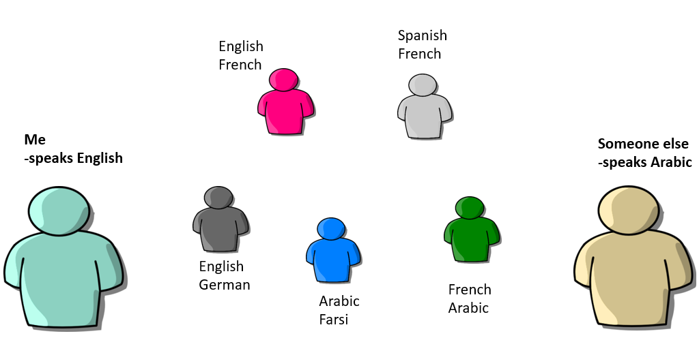
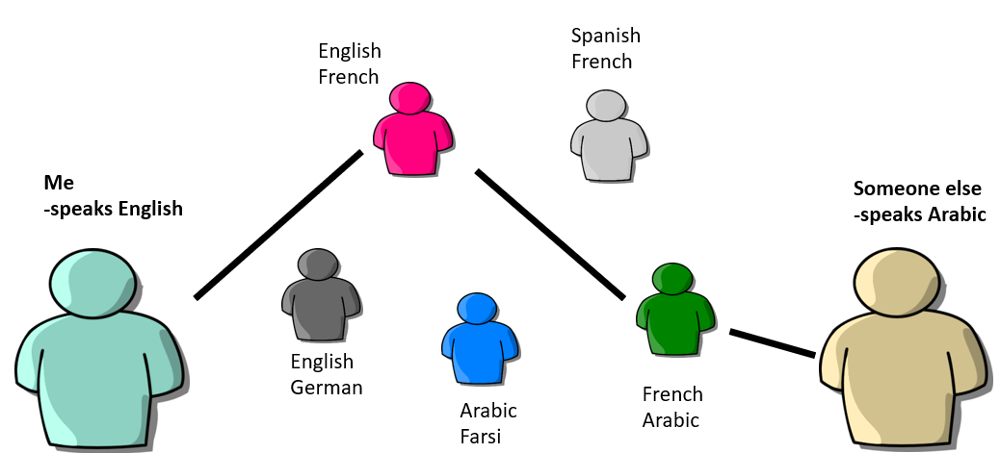

# Language Translation (Analogy)
In order to have computers do an automated activity, we will need to communicate with the computer. Let's start by looking at how communication works between different human languages.

 

Imagine I am an English speaker who wants to communicate with someone else who speaks Arabic. Neither of us speaks the other one's language. If we have access to people who speak multiple languages, it is possible for them to act as translators, taking what someone says and repeating it in another language, until we are able to get our messages back and forth.

So, given the set of bilingual translators in the above diagram, how can we translate between English and Arabic?

In my example, we use two translators: The English-French speaker and the French-Arabic speaker. Then in order for me to communicate with the Arabic speaker, we pass our message to the translators, and they communicate with each other using French as an intermediate language. So messages will be translated from English to French and then to Arabic one way, and from Arabic to French to English the other.

As we look at communicating with computers, we will see a similar translation path, including the use of intermediate languages.

Now let's look at the history of computers and communication with them.
