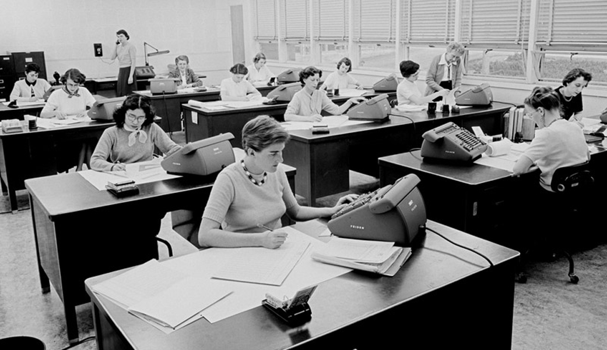
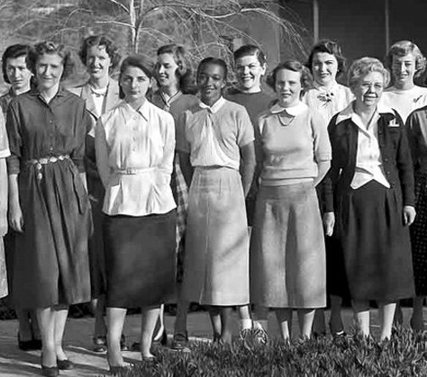

# Human Computers
 {cite:p}`WhenComputersWere`

Before electronic computers were generally available, when scientists wanted the results of some calculations, they sometimes hired "[computers](https://en.wikipedia.org/wiki/Computer_(occupation))" {cite:p}`ComputerOccupation2023`, which were people trained to perform the calculations.

 {cite:p}`HumanComputersEarly2023`

When scientists wanted these human computers to do a task for them, they would give these human computers instructions for what they wanted calculated. These instructions were given in a regular human language (like English), and in math notation. Then the human computers would send back the results of whatever calculation they had been asked to perform.

But human computers were eventually replaced by electronic computers, and communication with electronic computers was not straightforward.

## Learn More
- [When Computers Were Human](https://www.jpl.nasa.gov/edu/news/2016/10/31/when-computers-were-human/) {cite:p}`WhenComputersWere`
- [Human Computers: The Early Women of NASA](https://www.history.com/news/human-computers-women-at-nasa) {cite:p}`HumanComputersEarly2023`
- Read the book or watch the movie Hidden Figures
