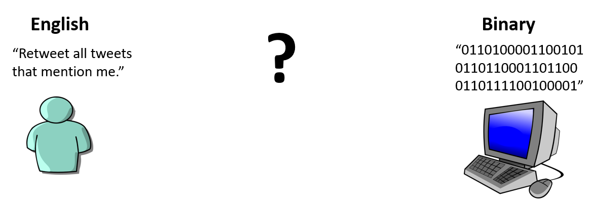
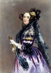

# Computers Speak Binary

As electronic computers became faster and more available, scientists began to rely on electronic computers to automatically perform their calculations instead of on human computers.

But computers don't speak human languages like the human computers did. Instead, computers speak binary:

I speak English, and so I can come up with an English statement of what I want the computer to do, like:
> “Retweet all tweets that mention me.”

But a computer only understands instructions that are written in binary, which is composed entirely of 0s and 1s. So somehow I'll need to turn my English instruction into binary instructions, so the computer can understand.

## Binary
Early in the history of computers, the designers of computers decided that the easiest way of making them work was to use the binary numbering system, since the 0s and 1s could be represented easily through physical means like a switch being on (which represents 1) or off (which represents 0).

These 0s and 1s, can then be used to represent numbers, like this:
- decimal 0 &rarr; binary 0
- decimal 1 &rarr; binary 1
- decimal 2 &rarr; binary 10
- decimal 3 &rarr; binary 11
- decimal 4 &rarr; binary 100
- decimal 5 &rarr; binary 101
- decimal 6 &rarr; binary 110
- decimal 7 &rarr; binary 111
- decimal 8 &rarr; binary 1000
- decimal 9 &rarr; binary 1001
- decimal 10 &rarr; binary 1010
- ...

But these binary 0s and 1s can be used for more than just representing numbers. In 1842, [Ada Lovelace](https://en.wikipedia.org/wiki/Ada_Lovelace) {cite:p}`AdaLovelace2023` realized that a [full computer](https://en.wikipedia.org/wiki/Turing_completeness) {cite:p}`TuringCompleteness2023` (which was only a theoretical possibility at the time) could represent and work with all sorts of things:
> [Computers] might act upon other things besides _number_ [...] Supposing, for instance, that the fundamental relations of pitched sounds in the science of harmony and of musical composition were susceptible of such expression and adaptations, the [computer] might compose elaborate and scientific pieces of music of any degree of complexity or extent.
>
>  {cite:p}`FileAdaLovelace2015`
>
> Augusta Ada King, Countess of Lovelace (1815-1852). Fun fact for those of you who are interested English Poetry: Ada Lovelace was the daughter of the poet Lord Byron.

Everything a modern computer does happens through binary. So all information is stored in binary, such as:
  - Text (like in this book). [For example](https://en.wikipedia.org/wiki/ASCII#Printable_characters) {cite:p}`ASCII2023`: "_A_" can be stored as "_1000001_" and "_B_" can be stored as "_1000010_"
  - Images are represented as a grid of points called [pixels](https://en.wikipedia.org/wiki/Pixel) {cite:p}`Pixel2023`, and each pixel has a number representing its color in terms of Red, Green, and Blue. So a pixel with the color of "_000000001111111100000000_" would be green.
  - Social media connections. For example, somewhere in Facebook's computer systems is information stored with your ID number, and it has a list of the ID numbers of the people you are friends with.

Additionally, all the instructions which tell a computer what to do are stored in binary as well. For example, in the [Intel 8080 computer](http://dunfield.classiccmp.org/r/8080.txt) {cite:p}`zotero-7163`:
  - "_00010100_" means "_add 1 to the number stored in register #2_"
  - "_11010010_" means "_jump to another set of instructions if condition #2 is true_"

These instructions and information are combined together to make any website you use, any computer game you play, and any online textbook you read.

So how do people turn their ideas into binary computer instructions?
