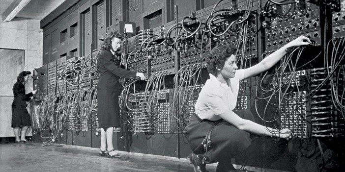
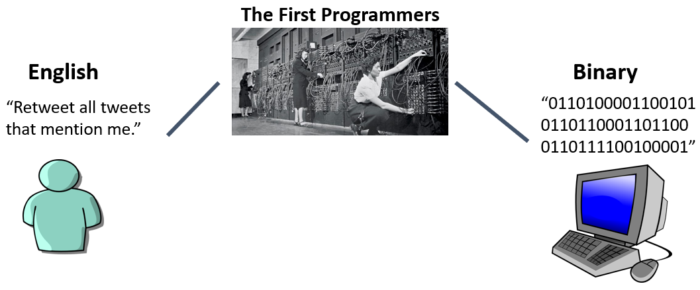

# First Programmers
The way the first computer programmers told computers what to do was by learning the binary language of computers and then translating their goals directly into binary instructions by themselves.

 {cite:p}`divisionNationalArchivesIdentifier2014`

The photo above shows the [ENIAC](https://en.wikipedia.org/wiki/ENIAC) {cite:p}`ENIAC2023` computer (built with US Army funds in 1945, this was the first electronic general-purpose computer), being programmed by three of the six women who were the original programmers on this computer: [Kay McNulty](https://en.wikipedia.org/wiki/Kathleen_Antonelli) {cite:p}`KathleenAntonelli2023`, [Betty Jennings](https://en.wikipedia.org/wiki/Jean_Bartik) {cite:p}`JeanBartik2023`, [Betty Snyder](https://en.wikipedia.org/wiki/Betty_Holberton) {cite:p}`BettyHolberton2023`, [Marlyn Meltzer](https://en.wikipedia.org/wiki/Marlyn_Meltzer) {cite:p}`MarlynMeltzer2023`, [Fran Bilas](https://en.wikipedia.org/wiki/Frances_Spence) {cite:p}`FrancesSpence2023`, and [Ruth Lichterman](https://en.wikipedia.org/wiki/Ruth_Teitelbaum) {cite:p}`RuthTeitelbaum2023`.

The job of these women was to take a request for a task to be done on the ENIAC, and to turn it into computer instructions, and enter those instructions into the computer (though this early computer happened to use decimal numbers and not binary).

_Note: Since this book is also about ethics, we should mention that the first thing these women were asked to program on the ENIAC was some calculations to help build [thermonuclear bombs](https://en.wikipedia.org/wiki/Thermonuclear_weapon) {cite:p}`ThermonuclearWeapon2023`. How do you think they might have felt about being asked to do this? The building of those bombs involved many scientists and other professionals along the way, several of whom were not on board with the idea of what their calculations were being used for. This has raised questions about moral responsibility: were the women made complicit in whatever moral wrongs may have come about using calculations they performed using the ENIAC?_

So, at this stage of computer history, giving a task to a computer involved a programmer translating the task directly into the computer's language (generally binary):

Now, this task of translating a task into the binary a computer speaks is a very slow, tedious, and difficult process. So why bother to go through all that trouble?

The reason it was worth it to go through the trouble of translating tasks into a computer's language is that computers can do two things very quickly: Arithmetic (e.g., 2 + 2 = 4), and following logical steps (e.g., _when_ you press this button, _then_ close the program). So if you can get your task translated into arithmetic and logical steps, the computer can work faster than a human could.

But this process of translating tasks into computer code was still a big pain, so couldn't there be a better way?
