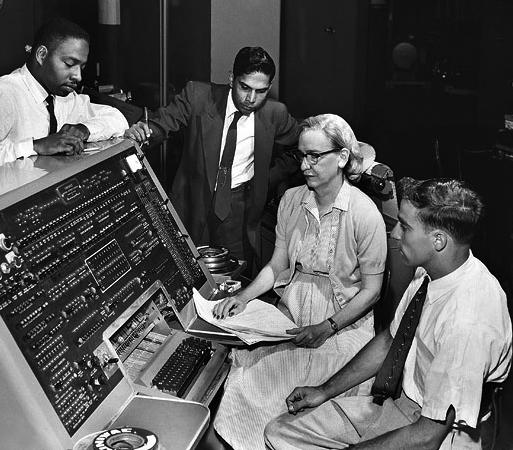

# Compilers and Programimng Languages

## History

In the early 1950s, [Grace Hopper](https://en.wikipedia.org/wiki/Grace_Hopper) {cite:p}`GraceHopper2023` proposed a better way of programming a computer. She suggested creating a “programming language” based on English words with a “compiler” computer program that would turn the computer language code into binary computer instructions.

 {cite:p}`unknownEnglishSINeg2004`
- photo of Grace Hopper c. 1960, at that time a Commander in the US Navy.

When Hopper's ideas were mostly ignored, she proceeded to create her own compiler and later helped design some of the most important and influential early programming languages and compilers.

## The new set-up for programming

So, thanks to Grace Hopper, we now have a new set-up for computer programming, which is what programmers still use today:

When someone wants a computer to perform a task (that hasn't already been programmed), a human programmer will act as a translator to translate that task into a programming language. Next, a compiler (or interpreter) program will translate the programming language code into the binary code that the computer runs. In this set-up, the programming language acts as an intermediate language the way that French did in my [earlier analogy](01_language_translation.md).

In this set-up, a programmers basic task is to do these three things:
1. Given a problem, break it down into steps for a computer
1. Write those steps down in a programming language
1. Run the compiler or interpreter, so the computer program can run on the computer

## Programming languages

Programming languages (e.g., Python, R, Java) are specially designed languages that attempt to split the difference between how a computer thinks and communicates and how people think and communicate. There are many programming languages, with different specializations and trade-offs.

In this book, we will use [Python](https://www.python.org/) {cite:p}`WelcomePythonOrg2023`, which is commonly used in data science tasks, and has support for writing programs that work with Reddit.

## Compilers / Interpreters
Compilers are special programs that translate code written in a programming language into the binary 0s and 1s that a computer runs.

There are two varieties of compilers:
- standard **compiler**: takes a whole computer program and turn it all into binary so it can be run later
- **interpreter**: turns the computer language code into binary as it is running the program

Python uses an interpreter, so when you run a Python program, the interpreter translates the Python code into binary while it's running it.

## Programming in this book
Throughout the rest of this book, we will take ideas for programs written in English and translate them into Python code, and we will look at Python code and translate it back into English descriptions of what the code does. The Python Interpreter will then translate this code into binary instructions, which the computer will then run.

Next, let's look at an example computer program that posts one tweet.
