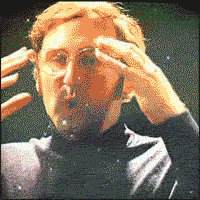
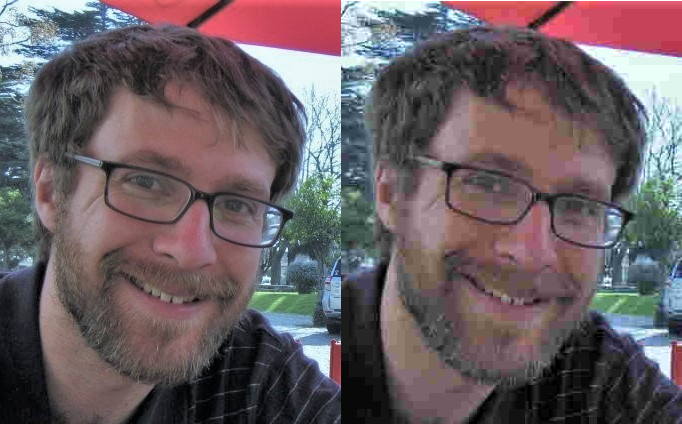

# Additional Data Types
You might have noticed that there are still a couple pieces of data on the example tweet that we haven't discussed yet. Let's look at those now.


## Images / Sounds / Videos

Our example tweet has several images in it:
```{figure} dog_tweet_with_images.png
---
name: tweet_images_fig
alt: "Screenshot of the tweet from before, but with the images highlighted: The user profile picture and the three puppy photos in the tweet contents"
---
The profile picture and the puppy photos in the tweet are images.
```

While you won't need to know the details of how images, sound, and video are stored for this book, we wanted to at least briefly discuss it here just to give you a rough idea of how computers store these kinds of data.

__Images__ are created by defining a grid of dots, called pixels. Each pixel has three numbers that define the color (red, green, and blue), and the grid is created as a list (rows) of lists (columns).

```{figure} pixels_fire_emoji.png
---
name: pixels_fire_emoji_fig
alt: "Two images of a fire emoji on a screen. The first is small and a little zoomed in, and you can sort of make out that the image is made of a bunch of squares. The second image is very zoomed in, and the white area behind the emoji is bands of red, green, and blue (which don't look they make white when separated), and the orange part of the fire mostly has just red bands, and the yellow part is red and green bands of color."
---
When viewing the fire emoji (🔥) close-up on a screen, you can see the bands of red, green, and blue that make up each pixel. If you try squinting your eyes or looking at the image from far away, it should blur back into the emoji.
```

% TODO: Images can also be represented as lists of shapes, colors, lines, etc. that can be redrawn to make the image ([vector graphics](https://en.wikipedia.org/wiki/Vector_graphics) {cite:p}`VectorGraphics2023`).

__Sounds__ are represented as the electric current needed to move a speaker's diaphragm back and forth over time to make the specific sound waves. The electric current is saved as a number, and those electric current numbers are saved at each time point, so the sound information is saved as a list of numbers.

```{figure} sound_wave_this.png
---
width: 300px
alt: An image of a sound wave for the word "this". There is a horizontal line in the middle, and a bunch of vertical bars that are approximately centered. The vertical bars are different lengths making a pattern of ups and downs that represent the sound wave.
align: center
---
A computer representation of the sound of Kyle saying "this."
```

```{figure} sound_wave_animation.gif
---
width: 400px
alt: An animation showing a sound wave data going up and down (like a sine wave). When the wave is high it pushes the speaker diaphragm away, and when it is low it pulls the speaker diaphragm closer, and as the diaphragm goes back and forth, sound waves come off of it.
align: center
---
How sound information turns into an electric signal, which then works with a magnet to push and pull on a [diaphragm inside a speaker](https://en.wikipedia.org/wiki/Electrodynamic_speaker_driver#Components) to create physical sound waves. Microphones do this process in exactly the reverse, the sound waves in the air make the speaker diaphragm go back and forth, making an electric current in the wire which gets measured and saved by the computer.
```

% TODO: Sound can also be represented in other ways, such as music being represented by lists of which instrument should play which note at which time (see [MIDI files](https://en.wikipedia.org/wiki/MIDI) {cite:p}`MIDI2023`).

% TODO: Mention Ada lovelace


__Videos__ are represented as a sequence of images (a list of images) called frames, often with a sound wave to be played at the same time.



In most cases, after the initial data representation is created, the computer runs a compression algorithm, which takes the image, sound, or video, and finds a way of storing it in much less computer memory, often losing some of the quality when doing so.



### Metadata
In addition to the main components of the images, sound, and video data, this information is often stored with metadata, such as:
- The time the image/sound/video was created
- The location where the image/sound/video was taken
- The type of camera or recording device used to create the image/sound/video
- etc.

For our purposes in this class, most of the time we run into images, we will find a string that tells us where the image, video, or sound is saved (e.g., we'll get something like "kylethayer.jpg"), and we might additionally get some metadata.

## Dates and Times
The final piece of data from the tweet we will cover is the date when the tweet was posted:

```{figure} dog_tweet_with_date.png
---
name: tweet_date_fig
alt: "Screenshot of the tweet from before, but with the date highlighted: Feb 10, 2020"
---
The tweet includes the date when it was posted.
```
There are several options for how to save dates and times. Some options include a series of numbers (year, month, day, hour, minute, and second), or a string that with all of those pieces of information written out. Sometimes only the date is saved, with no time information, and sometimes the time information will include the timezone.

Dates turn out to be one of the trickier data types to work with in practice. One of the main reasons for this is that what time or day it depends on what time zone you are in.

So, for example, when Twitter tells me that the tweet was posted on Feb 10, 2020, does it mean Feb 10 for me? Or for the person who posted it? Those might not be the same. Or if I want to see for a given account, how much they tweeted "yesterday," what do I mean by "yesterday?" We might be in different time zones and have different start and end times for what we each call "yesterday."

Note: We'll work with dates and times a little bit in chapter 18: Public Shaming
