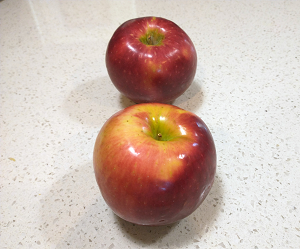
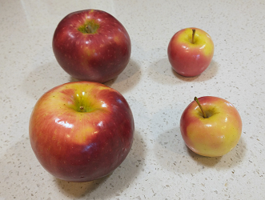
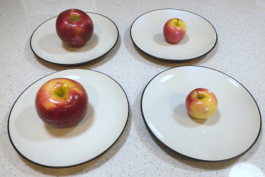

# All data is a simplification of reality

We've talked about how we represent data on a computer, but let's now step back and think about the nature of data itself.

Note: This section was inspired by Kareem Carr
- [https://twitter.com/kareem_carr/status/1551950155330600960](https://twitter.com/kareem_carr/status/1551950155330600960) {cite:p}`kareemcarr|datascientist[@kareem_carr]Summer2020Got2022`
- [Why Some People Think 2+2=5 ...and why they're right.](https://www.popularmechanics.com/science/math/a33547137/why-some-people-think-2-plus-2-equals-5/) {cite:p}`PeopleThinkThey2023`

## Twitter Users vs. Bots

Let's look at a debate around a specific data point:
>" Twitter has repeatedly said that spam bots represent less than 5% of its total user base. [Elon] Musk, meanwhile, has complained that the number is much higher, and has threatened to walk away from his agreement to buy the company."
>
> [Musk’s Dispute With Twitter Over Bots Continues to Dog Deal](https://www.bloomberg.com/news/articles/2022-07-07/twitter-reiterates-that-spam-bots-are-well-under-5-of-users) {cite:p}`MuskDisputeTwitter`, by Kurt Wagner, Bloomberg July 7, 2022

The data in question here is over what percentage of Twitter users are spam bots, which Twitter claimed was less than 5%, and Elon Musk claimed is higher than 5%.

Data points often give the appearance of being concrete and reliable, especially if they are numerical. So when Twitter initially came out with a claim that less than 5% of users are spam bots, it may have been accepted by most people who heard it. Elon Musk then questioned that figure and attempted to [back out of buying Twitter](https://www.npr.org/2022/07/08/1110539504/twitter-elon-musk-deal-jeopardy) {cite:p}`bondElonMuskWants2022`, and Twitter is [accusing Musk's complaint of being an invented excuse](https://www.npr.org/transcripts/1111032233) {cite:p}`TwitterTakesElon2022` to back out of the deal, and [the case is now in court](https://www.npr.org/transcripts/1111032233) {cite:p}`TwitterTakesElon2022`.

When looking at real-life data claims and datasets, you will likely run into many different problems and pitfalls in using that data. Any dataset you find might have:
- missing data
- erroneous data (e.g., mislabeled, typos)
- biased data
- manipulated data

Any one of those issues might show up in Twitter's claim or Musk's counterclaim, but even in the best of situations there is still a fundamental issue when looking at claims like this, and that is that:

> All data is a simplification of reality.

Let's consider a concrete example involving apples:

## Counting Apples
We all know simple math facts, like 2 + 2 = 4, and 4 = 1 x 4. So that means that if we had two apples like this:

And if we added two more apples, we would have 4 apples (because 2 + 2 = 4), like this:

And if there were four of us who wanted to have apples, we could give each person 1 apple, and they would have the same number of apples (because 4 = 1 x 4), like this:

Now, while each person has 1 apple, you might complain that it isn't fair (and if you try this with children, they will almost certainly let you know it isn't fair), since the apples weren't all the same size. Two of the four apples were particularly small.

So, there was a simplification here. In this example, I decided that each of these would count as "1 apple." This way of looking at things might not work well in some situations:
- If we want everyone to get the same amount of apples by weight, we would have to cut the apples into pieces so we could give each person the same amount.
- If we wanted to give everyone some amount of apple that they could keep for a few days before eating, then we would want to not cut the apples, so keeping them as whole apples might be the best solution.

## What we lose in simplifying

As you can see in the apple example, any time we turn something into data, we are making a simplification.[^symbolic_data_not_simplified] If we are counting the number of something, like apples, we are deciding that each one is equivalent. If we are writing down what someone said, we are losing their tone of voice, accent, etc. If we are taking a photograph, it is only from one perspective, etc.
- Different simplifications are useful for different tasks. Any given simplification will be helpful for some tasks and be unhelpful for others.
  - See also, this saying in statistics: [All models are wrong, but some are useful](https://en.wikipedia.org/wiki/All_models_are_wrong) {cite:p}`AllModelsAre2023`

% TODO:
% Arhie Phinney (Nez Perce)

% A sad thing in recording these animal stories is the loss of spirit — the fascination furnished by the peculiar Indian vocal rendition for humor.  Indians are better storytellers than whites.  When I read my story mechanically I find only the cold corpse.

% https://thebcreview.ca/2016/12/15/chapter-seven/#_ftn11
% Archie Phinney to Franz Boas, 20 November 1929.  2394. PHINNEY, ARCHIE. Correspondence with Franz Boas 1929-1934. Courtesy C. Greifenstein, Manuscripts Library, American Philosophical Society. Phinney was a Nez Perce anthropologist who worked with Boas at Columbia University. See “Archie Phinney obituary”. American Anthropologists 52:3, pp. 442 (1950).

[^symbolic_data_not_simplified]: There is one exception where you can have data that isn't a simplification, and that is if the data source is symbolic (e.g., numbers) and you are applying unambiguous rules (e.g., math). Since it starts out as a symbol, it doesn't need to be simplified to be represented with symbols. For example, data that can be made without simplification include: <ul><li>A list of the first 10 prime numbers.</li> <li>The number of times the letter 'a' (capital or lowercase) appears in this sentence.</li>

## More examples of simplifications
So all data that you might find is a simplification. There are many seemingly simple questions that in some situations or for some people, have no simple answers, questions like:
- What country are you from?
  - _What if you were born in one country, but moved to another shortly after? What if you are from a country that no longer exists like Czechoslovakia? Or from an occupied territory?_
- How many people live in this house?
  - _Does a college student returning home for the summer count as living in that house?_
- How many words are in this chapter?
  - _[Different programs use different rules for what counts as a "word"](https://thehappybeavers.com/blog/why-word-count-differ-programs/) {cite:p}`WhyDoesWord`_
    - E.g., this page has "2 + 2 = 4", which Microsoft Word counts as 5 words, and Google Docs counts as 3 words.

## Revisiting Twitter Users vs. Bots

Let's go back to the question of whether less than 5% of Twitter users are spam bots.

In this claim are several places where there are simplifications being made, particularly in the definitions of "Twitter users" and "spam bots."

### Measuring Twitter users:
How do we count how many users are on Twitter?

It depends on if we mean how many accounts have been registered vs. how many people are logged into Twitter on a given day. And it also depends on how we count situations where one person has many accounts, or many people share a corporate account.

### Measuring spam bots
How do we count how many spam bots are on Twitter?

The Bloomberg article we quoted mentions "spam bots" as what is being measured, but Elon Musk has used phrases like "[fake or spam](https://twitter.com/elonmusk/status/1555950698252181507?s=20&t=pY_aYXjSOzD-sUOW8E1e6A) {cite:p}`elonmusk[@elonmusk]Andst7HerebyChallenge2022`" accounts and "[fake/spam/duplicates](https://twitter.com/elonmusk/status/1525723506805288962?s=20&t=aBUK4_IT354Y9TC69PMldg) {cite:p}`elonmusk[@elonmusk]PPatholeExactlyHave2022`," which might lead to different numbers.

Parag Agrawal, the Twitter CEO, additionally clarified the complications of measuring "spam" accounts, saying:
> Next, spam isn’t just ‘binary’ (human / not human). The most advanced spam campaigns use combinations of coordinated humans + automation. They also compromise real accounts, and then use them to advance their campaign. So – they are sophisticated and hard to catch.
>
> ([tweet link](https://twitter.com/paraga/status/1526237581419040768) {cite:p}`paragagrawal[@paraga]NextSpamIsn2022`)

Since Elon Musk purchased Twitter (and rebranded it as "X"), the bot problem has reportedly gotten [much](https://www.npr.org/2024/03/07/1235784919/twitter-x-bots-social-media-elon-musk), [much](https://mashable.com/article/x-twitter-elon-musk-bots-fake-traffic), worse {cite:p}`restrepo_how_2024` {cite:p}`binder_majority_2024`. 

### What changes with these measures?
While we don't have direct access to all the data ourselves, we can imagine that different definitions would lead to different results. And there isn't a "best" or "unbiased" definition we should be using, since all definitions are simplifications that will help with some tasks and hurt with others.

We have to be aware that we are always making these simplifications, try to be clear about what simplifications we are making, and think through the ethical implications of the simplifications we are making.
