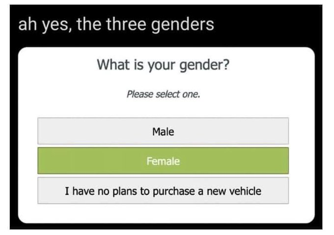

# Who does data fit?
Because all data is a simplification of reality, those simplifications work well for some people and some situations but can cause problems for other people and other situations.

Thus, when designers of social media systems make decisions about how data will be saved and what constraints will be put on the data, they are making decisions about who will get a better experience. Based on these decisions, some people will fit naturally into the data system, while others will have to put in extra work to make themselves fit, and others will have to modify themselves or misrepresent themselves to fit into the system.

So, for example, if we made a form that someone needed to enter their address, we could assume everyone is in the United States and not have any country selection.
- Address fields:
  - Street address
  - City
  - State
  - Zip Code

Someone in another country would have to try to find a way to indicate that they aren't in the United States even though there is no clear place to indicate that. If this is a form for shipping to people in the US only, then this limitation might make sense.

If we wanted people to be able to enter other countries we could make a country drop-down tool to select a country, but then would we auto-fill it with a country? If there is a list of countries to scroll through, what order do we put them in? If it's alphabetical, that will make it easier for people in countries whose name starts with "A."

## Form fails
Let's look at some examples where forms show problems with data entry and representation:

### Name Length
Here are some screenshots from a [help forum discussion](https://ttlc.intuit.com/community/taxes/discussion/my-last-name-is-to-long-what-do-i-do/00/655670) {cite:p}`MyLastName2019` on the United States tax software TurboTax:

As you can see, TurboTax has a limit on how long last names are allowed to be, and people with too long of names have different strategies with how to deal with not fitting in the system.

### Gender
Data collection and storage can go wrong in other ways as well, with incorrect or erroneous options. Here are some screenshots from a thread of people collecting strange gender selection forms:

-  {cite:p}`annalytical[@theannalytical]SendMeWorst2021`

-  {cite:p}`annaholmes[@annabookwriter]TheannalyticalMckellogsNot2021`

You can see more of these types of forms at [https://genders.wtf/](https://genders.wtf/)

% TODO: Add Individual vs. systemic analysis here, include [structural problem tweet](https://twitter.com/athertonkd/status/1120376944061583360) {cite:p}`kelseyd.atherton[@athertonkd]OhYouRe2019`
% Probably add Anna's thing about humanizing