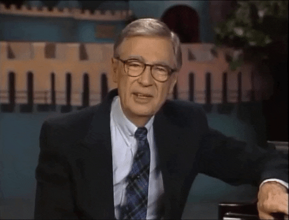

# Parasocial Relationships

Another phenomenon related to authenticity which is common on social media is the [parasocial relationship](https://en.wikipedia.org/wiki/Parasocial_interaction) {cite:p}`ParasocialInteraction2023`.

Parasocial relationships are when a viewer or follower of a public figure (that is, a celebrity) feel like they know the public figure, and may even feel a sort of friendship with them, but the public figure doesn't know the viewer at all.

Parasocial relationships are not a new phenomenon, but social media has increased our ability to form both sides of these bonds. As comedian Bo Burnham put it: "[This awful D-list celebrity pressure I had experienced onstage has now been democratized.](https://www.npr.org/2018/07/18/630238825/comic-bo-burnham-on-eighth-grade-social-media-anxiety)" {cite:p}`nComicBoBurnham2018`


Learn more about parasocial relationships:
 - StrucciMovies: [Fake Friends YouTube Series](https://www.youtube.com/watch?v=x3vD_CAYt4g&list=PL7-HzFax9fcxbuDiKPZGdIV69N5-MszEa) {cite:p}`struccimoviesFAKEFRIENDSEPISODE2017`
 - Sarah Z: [How Fans Treat Creators](https://www.youtube.com/watch?v=f0l_biTU3Vg) {cite:p}`sarahzHowFansTreat2020` 33 min


## Example: Mr. Rogers
As an example of the ethically complicated nature of parasocial relationships, let's consider the case of [Fred Rogers](https://en.wikipedia.org/wiki/Fred_Rogers) {cite:p}`FredRogers2023`, who hosted a children's television program from 1968 to 2001.

In his television program, Mr. Rogers wanted all children to feel cared for and loved. To do this, he intentionally fostered a parasocial relationship with the children in his audience (he called them his "television friends"):
> I give an expression of care every day to each child, to help him realize that he is unique. I end the program by saying, "You've made this day a special day, by just your being you. There's no person in the whole world like you, and I like you, just the way you are."
>
> [Fred Rogers requesting funds for PBS at the US Senate in 1969](https://misterrogers.org/videos/pastore/) {cite:p}`FredRogersTestifies`



Now, as children, I (Kyle) and my sister watched this program and felt the effects of what Fred Rogers was doing and had different responses to it. I asked my mom to help me send him a letter asking if he was real, to which I got a letter back explaining that he was indeed a real person:

```{figure} mr_rogers_letter_to_kyle.jpg
---
name: mr_rogers_letter_to_kyle
width: 400
alt: "A letter written on a typewriter:
June, 1988
Dear Kyle,
It was good to get to know you and your sister from your letter and the photo you sent. We will be sure to find a special place for your picture in the album we keep of our television friends.
You told me that you wonder if I am real. Kyle, I know that it's hard to understand about all the things children see on television. I am a real man. I don't live in the television house; that is set up in our television studio. I live in a real house with my family.
Here are some photos for you and Jessica and a copy of an old newsletter of ours which I thought you might like to read. The picture of my family was taken a long time ago -- my sons are grown young men now. James is 28 and John is 26. I also thought you would like to know that there is a biography about me. It is called, MISTER ROGERS, GOOD NEIGHBOR TO AMERICA'S CHILDREN, by JoAnn and Anthony Di Franco. This book might be at your local library. Kyle, it gives me a good feeling to know that we're television friends. You are special -- just because you're you.
Your television friend,
Mister Rogers"
---
Fred Rogers explaining he is a real person to me.
```

My younger sister then wanted to send her own letter to Mr. Rogers, inviting him to stay at our house (he could sleep on the floor if he wanted).

```{figure} mr_rogers_letter_to_jessica.jpg
---
name: mr_rogers_letter_to_jessica
width: 400
alt: "A letter written on a typewriter (note: I fixed a close quote):
November, 1989
Dear Jessica,
Thank you for you letter and the photograph you sent. I liked seeing the picture of you and Kyle. What fine children you are! We will be sure to find a special place for your photo in the album of our television friends.
It meant a lot to know you would like me to come to your house to visit. I wish it were possible to meet with the girls and boys who want to visit, but I am busy at work, and I need to spend my relaxing time with my family. Even though we can't have a real visit, it is good that we can have television visits and a letter visit like this one.
Jessica, there are many ways to say \"I love you,\" and writing that in your letter is a good way. My way to say \"I care about you is to make television programs for children, and I'm glad to know you're watching.\"
Here are pictures for you and Kyle with best wishes from all of us here in the Neighborhood. Each of you is special just because you're you.
Your television friend,
Mister Rogers"
---
Fred Rogers explaining to my younger sister (Jessica), that he can't come visit our house.
```

Now, of the two of us at this time, I had some skepticism, but my younger sister, Jessica, had the strongest parasocial relationship with Mr. Rogers. Jessica probably believed that Mr. Rogers knew her and liked her. We can break this into two parts:
- She believed Mr. Rogers knew her (or was at least close enough that he would come over to visit).
  - This belief was almost certainly false. He may have known who she was for a brief moment when responding to this letter (or signing one his secretary wrote or something).
- She believed that if she saw Mr. Rogers (like if he came over to our house), he would like her.
  - Based on [what is known publicly about Fred Rogers](https://www.esquire.com/entertainment/tv/a27134/can-you-say-hero-esq1198/) {cite:p}`DefinitiveMrRogers2017`, this was probably true.


In the above example, you can see how Fred Rogers was trying to define and clarify the parasocial nature of the relationship (e.g., "television friends", "television visits"). We can then ask what was authentic or inauthentic about this relationship, and we can analyze the ethics of what Fred Rogers was doing.

## Reflection questions
- Where do you see parasocial relationships on social media?
- In what ways are you in parasocial relationships?
- What are the ways in which a parasocial relationship can be authentic or inauthentic?
  - both for the celebrity and for the viewer/follower
