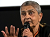

# What is Colonialism?
As most social media platforms are headquartered in a very set of locations (e.g., Silicon Valley in the US, and Beijing China), but used all over the world, it is important for us to look at the concepts and history of colonialism to understand what it means for social media to be controlled in these few places.

So let's start by defining colonialism and some related concepts.

## Colonialism Defined
[Colonialism](https://plato.stanford.edu/entries/colonialism/) {cite:p}`kohnColonialism2023` is when one group or country subjugates another group, often imposing laws, religion, culture, and languages on that group, and taking resources from them. Colonialism is often justified by belief that the subjugated people are inferior (e.g., barbaric, savage, godless, backwards), and the superiority of the group doing the subjugation (e.g., civilized, advanced).

- Key figures:
  - [](https://en.wikipedia.org/wiki/Hern%C3%A1n_Cort%C3%A9s) {cite:p}`HernanCortes2023` [Hernán Cortés](https://en.wikipedia.org/wiki/Hern%C3%A1n_Cort%C3%A9s), 1500s, Spain &rarr; America
  - [](https://en.wikipedia.org/wiki/Francisco_Pizarro) {cite:p}`FranciscoPizarro2023` [Francisco Pizarro](https://en.wikipedia.org/wiki/Francisco_Pizarro), 1500s, Spain &rarr; South America
  - [](https://en.wikipedia.org/wiki/John_Smith_(explorer)) {cite:p}`JohnSmithExplorer2023` [John Smith](https://en.wikipedia.org/wiki/John_Smith_(explorer)), 1600s, England &rarr; North America
  - [](https://en.wikipedia.org/wiki/Leopold_II_of_Belgium) {cite:p}`LeopoldIIBelgium2023` [King Leopold II of Belgium](https://en.wikipedia.org/wiki/Leopold_II_of_Belgium), 1800s, Belgium &rarr; Congo

### "[White Saviors](https://en.wikipedia.org/wiki/White_savior)" {cite:p}`WhiteSavior2023`
Sometimes colonialism is a little bit more subtle. For example, the term "White Savior" is a sarcastic term for white people being seen as liberating or rescuing “helpless” non-white people. This is common in TV and movies (see the TVTropes entries on [Mighty Whitey](https://tvtropes.org/pmwiki/pmwiki.php/Main/MightyWhitey) {cite:p}`MightyWhitey`, and [White Man’s Burden](https://tvtropes.org/pmwiki/pmwiki.php/Main/WhiteMansBurden) {cite:p}`WhiteManBurden`). For example, consider movies like James Cameron’s Avatar movies, Dances with Wolves, The Last Samuri (starring the Tom Cruise), The Blind Side, The Help, La La Land ([where a white man is trying to save "real" Jazz music](https://www.mtv.com/news/5qr32e/la-la-lands-white-jazz-narrative) {cite:p}`LandWhiteJazz`), etc.

```{figure} the_last_samurai.jpg
---
name: the_last_samurai_fig
alt: "Movie Poster. Top center is Tom Cruise's face. Below it is text \"Tom Cruise\", then in smaller text \"The Last Samurai\". On the sides of the poster are Japanese characters."
---
[Poster](https://en.wikipedia.org/wiki/File:The_Last_Samurai.jpg) {cite:p}`FileLastSamurai2021` for the movie [The Last Samurai](https://en.wikipedia.org/wiki/The_Last_Samurai) {cite:p}`LastSamurai2023`, starring white American Tom Cruise.
```


## [Decolonization](https://en.wikipedia.org/wiki/Decolonization) {cite:p}`Decolonization2023` / [Postcolonialism](https://en.wikipedia.org/wiki/Postcolonialism) {cite:p}`Postcolonialism2023` / [Liberation](https://en.wikipedia.org/wiki/Liberation_movement) {cite:p}`LiberationMovement2023` / [Landback](https://en.wikipedia.org/wiki/Land_Back) {cite:p}`LandBack2023`

Counter to colonialism, decolonization, postcolonialism, liberation, and landback are movements where the colonized/oppressed take back power from the colonialists/oppressors, and grapple with the consequences of having been colonized. This may be a response to colonization by:
- Government occupation (e.g., England ruling India/Pakistan, USA removing Indigenous Americans from their land, USA ruling Cuba and the Philippines)
  - Key figures:
    - [](https://en.wikipedia.org/wiki/Mahatma_Gandhi) {cite:p}`MahatmaGandhi2023` [Mahatma Gandhi](https://en.wikipedia.org/wiki/Mahatma_Gandhi), 1800s-1900s, India
    - [](https://en.wikipedia.org/wiki/Toussaint_Louverture) {cite:p}`ToussaintLouverture2023` [Toussaint Louverture](https://en.wikipedia.org/wiki/Toussaint_Louverture), 1700s-1800s, Haiti
    - [](https://en.wikipedia.org/wiki/Patrice_Lumumba) {cite:p}`PatriceLumumba2023` [Patrice Lumumba](https://en.wikipedia.org/wiki/Patrice_Lumumba), 1900s, Congo
- Oppressed group in a country with restricted rights or ability to make their voices heard (e.g., women’s rights and civil rights movements in USA)
  - Key figures:
    - [](https://en.wikipedia.org/wiki/Susan_B._Anthony) {cite:p}`SusanAnthony2023` [Susan B. Anthony](https://en.wikipedia.org/wiki/Susan_B._Anthony), 1800s-1900s, USA
    - [](https://en.wikipedia.org/wiki/Martin_Luther_King_Jr.) {cite:p}`MartinLutherKing2023` [Martin Luther King Jr.](https://en.wikipedia.org/wiki/Martin_Luther_King_Jr.), 1900s, USA
    - [](https://en.wikipedia.org/wiki/Nelson_Mandela) {cite:p}`NelsonMandela2023a` [Nelson Mandela](https://en.wikipedia.org/wiki/Nelson_Mandela), 1900s-2000s, South Africa
- Cultural and economic dominance (e.g., the global power centers of Silicon Valley, Hollywood, Wall Street, etc.)
  - Key figures:
    - [](https://en.wikipedia.org/wiki/Gayatri_Chakravorty_Spivak) {cite:p}`GayatriChakravortySpivak2023` [Gayatri Chakravorty Spivak](https://en.wikipedia.org/wiki/Gayatri_Chakravorty_Spivak), present, India, USA
    - [](https://en.wikipedia.org/wiki/Edward_Said) {cite:p}`EdwardSaid2023` [Edward Said](https://en.wikipedia.org/wiki/Edward_Said), 1900s-2000s, Palestine, USA
